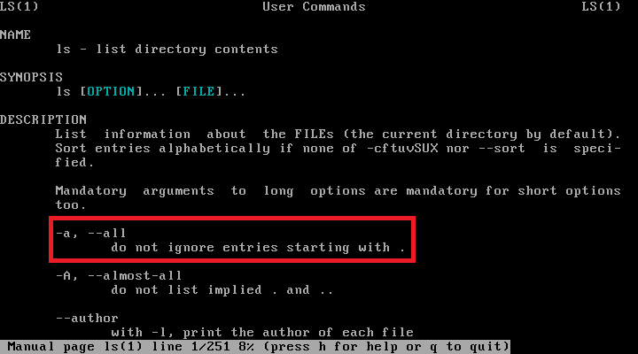
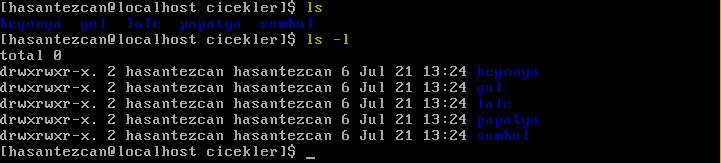
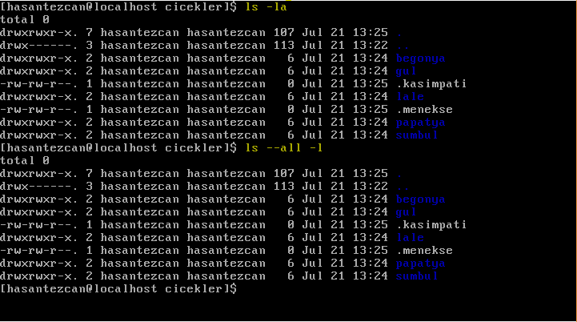

### ÖYYK 2018 - GNU/Linux Sistem Yönetimi 1.Düzey - (GÜN 1)
---
>**KISS “Keep It Simple, Stupid”**
- Basit çözümler daha iyidir çünkü:
  - Basit çözümlerin uygulanması daha kolaydır.
  - Basit çözümler hataya daha az açıktır.
  - Basit çözümlerin bakımını yapmak daha kolaydır. Zaman tasarrufu sağlar.
  - Basit çözümler kolay değiştirilebilir. Çevik olma açısından gereklidir.

## Linuxde Dosya Dizin Hiyerarşisi:
- GNU Linux sistemlerde bir dosya dizin hiyerarşisi vardır. Ve bunu en üstünde **"/"** yani **root (kok)** bulunur bu tüm sistemin referans noktasıdır.

- Öncelikle kafaları çok karıştıran bir problemi çözüp anlatımımıza öyle devam edelim.
  - dizin nedir? Dizin = klasör = folder = directory
  - dosya nedir? Dosya = file

  fakat bunla beraber GNU Linux de her dizin de aslında birer dosyadır.

- **"/" root - kok dizini**
  - Tüm dizinlerin üstünde bulunan dizindir. Tüm dizinler burdan dallanarak devam eder.

- **/bin** = Sisteminin temel komutlarının bulunduğu binarı dizinidir.
    - Birçok yararlı komut /bin klasörü altındadır.***cat, mkdir, cp, ls, mv, rm*** vb. temel komutların hepsini burada bulabilirsiniz.

- **/etc** = Sistemin ayar dosylarının olduğu dizindir.
  - Sisteme dair bütün yapılandırma, bu klasör veya bu klasörün alt klasörlerinde bulunur. Yapılandırma dosyası, bir programın işlemlerini kontrol etmek için kullanılan lokal bir dosyadır; durağandır ve çalıştırılmak için değildir.

- **/home** = Kullanıcıların kayıtlı dosyalarını, kişisel ayarlarını vb. içeren ev dizinleridir.
  - Windows'taki Documents and Settings'e benzetebiliriz.
  - Her bir yeni kullanıcı için alt dizin olarak altına oluşturulur.
  ```
  home ---> haşantezcan  
  |-----> boratanrıkulu
  ```

- **/var** = Sistem değişkenleri saklar.
  - Log dosyaları, e-mail ve printer kuyrukları gibi değişken sistem bilgilerini barındırır. Sisteminize dair tutulan log'ları buradan görebilir; güvenlik durumunu buradan kontrol edebilirsiniz.

- **/lib** = Kütüphane dosyaları bulunur.
  - Kernel modülleri ve paylaşılan kütüphane dosyaları bu klasörde bulunur. Var olan çekirdek modüllerini /lib/modules/[versiyon_numarası] içersinde bulabilirsiniz.

- **/opt** = Üçüncü parti programların kurlduğu dizindir.
  ```
  /opt
  |-----> chromium
  ```

- Linux bir sistemde çalışırken unutulmaması gerek en önemli şeylerden birde sürekli bir dizinde olduğunuzdur.

        !! Sürekli bir dizinin içindeyiz

>Daha detaylı bir kaynak arayanlar için ["tldp.org-Linux-Filesystem-Hierarchy"](https://www.tldp.org/LDP/Linux-Filesystem-Hierarchy/html/index.html)

- Bir dosyanın yeri tarif ederken kullanıdğimiz iki turlu yol vardır. Bunlar ***Tam Yol*** ve ***Göreceli Yol*** dur.

  - **Tam Yol :** Herzaman root dizininden başlar ve hedef gösterdiğimiz dizine kadar devam eder.
Bu komutu hangi dizinde olursak olalım çalıştırdığımızda sonuç alırız. Çünkü bu tarif hiç bir zaman değişmez. Bunun nedeni de referans aldığı ilk yolun root olamsidir.

  - **Göreceli Yol :** Bu tarifin herzaman geçerliliği yoktur. Bulunulan komut referans alınılarak hedefe ulaşılmaya çalışılır. Anlık doğru yol olrak kabul edilir.


----
  ### ***Soru Cevap Kısmı***

  > Doruk Fişek'in ders esnasında sorduğu sorulardan bazıları..

  - "**/home/hasatezcan/.bashrc**" dizinini silersek ne olur?

    ***Global tanımlı*** olarak bulunan **/etc/.bashrc** dizininden çalışmaya devam eder.

  - Ayar dosyaları ***/etc*** içinde mevcutken neden /boot altında da ayar dosyaları bulunuyor?
  >. . .

  - ***/var*** dizini ne için var?

    Home dizini kullanıcıların dosyalarını depolarken, /var dizini içinde de programların oluşturduğu veriler tutulur.

    **Örnek:**
    - bir veri tabanın ürettiği veriler ***/var*** içinde tutuluyor.
    - log'lar var dizini altında tutuluyor.

  - ***/opt*** dizini neden var?

    Windows mantığı ile geliştirilimiş programlar Unıx dosya dizin hiyerarşisine uymazlar. bu şekilde geliştirilen prgramları lınux /opt dizinide atar ve binevi onlardan kurtulmuş olur.

  - Sistemdeki tüm kulanıcıların ev dizini ***/home*** altında peki neden root kullancısının ev dizini direk ***/*** (yani root dizini altında) ?
  >. . .

  - Normalde root altında bulunan /bin ve /lib dışında /usr içinde de yine bu dizinler var peki neden bu dizinler varlar?
  >. . .

  - ***/bin*** - ***/sbin*** - ***/etc/bin*** - ***/etc/sbin*** nedir bu bin dizinleri...?
  >. . .

  - ***/lib*** ve ***/lib64*** olmak üzere iki farklı klasör mevcut iken neden ***/bin*** ve ***/bin64*** diye iki farklı dizin mevcut değil?
  >. . .

-----

### Linux'de Temel Komutlar

- Linuxde hayatta kalmanız için bilmeniz gereken en önemli şey terminal komutlarıdır. Linux bünyesinde sayısız terminal komudu olmakla birlikte bunların herbirini bilmeniz gerekmez. Şimdi linuxde en çok kullanıdğımız komutlarla bir göz atalım.

**komut - (ingilizce açılımı) => açıklama  [komutun kullanımı]**

- **man** - (*manual*) **>>** Bir komutun nasıl kullanılacağı hakkında bilgi verir.**[man ls]** *gibi..*
  - Bu komuta çok sık başvurcağız dediğim gibi her şeyi ezbere bilemeyiz ve bilmemiz de gerekmez. Bu manuallerde komutla ilgili aradığınız her şeyi bulmanız mümkün. Ayrıca **man** gibi sizlere yardımcı olcak bir başka yardımcı ise **[komut --help]** dir.

- **pwd** - (*print working directory*) **>>** çalışılan dizini yazdırır.
  - Her şeyden önce nerdeyiz siyah bir ekranda nerde olduğunuz bir şeyler sormadan öğrenemezsiniz. Bu komut bize hangi dizinin içinde olduğumuzu söyler. Terminalin kutup yıldızı :D

- **ls** - (*list*) **>>** Herhangi bir dizinin içini görmek için kullandığımız komutdur.
  - Bir dizin içindeyken öğrenmek istiyeceğiniz en mühüm bilgi burda nerlerin olduğudur. Ve ayrıca ls komudunu kullanırken illa bir dizinin içinde olmanızda gerekmez. "ls" yazıp dosya yolunu vererekden de istediğiniz dökümanın içinde ne olduğunu göreblirsiniz.

- **cd** - (*change directory*) **>>** Dizin değiştirmemizi sağlar. **[cd ../ ya da cd klasör_adi/]**
 - Sıra geldi yer değiştirmeye "pwd" ile nerdeyiz onu öğrendik "ls" ile nerelere gidebiliriz onu öğrendik. şimdi de harekete geçiyoruz. **[cd /klasör_adi]** diyerekden dizinin içine girebiliriz. Peki nasıl geri çıkıcaz? Geri çıkmak için de **[cd ..]** komutunu kullanıyoruz. **Neden çıkmak kelimesini kullandığıma sonra gelicem.**

- **touch** - ( ) **>>** Dosya oluşturmak için kullanırız. **[touch dosya_adı]**
  - Bu komutla dosya oluşturuyoruz. Aynı anda birden fazla dosya da oluşturmak mümkün.

  - FOTO GELSİN

- **mkdir** - (*make directroy*) **>>** yeni bir dizin(folder) oluşturur. **[mkdir klasör_adı]**
  - Bu komutlada yeni dizinler oluşturabilriz. Aynı andan birden fazla dizin oluşturmak burda da mümkün.

- **rm** - (*remove*) **>>** Çok pis siler. **[rm dosya_yolu]**

  * **rm -r** dersek de dosyalarıda siler çünkü rm yalın halde sadece klasör siler.

- **rmdir** - (*remove empty directories*) **>>** boş dizinleri siler **[rmdir [OPTION]... DIRECTORY]**

- **cp** - (*copy*) **>>** kopyalar. **[cp [OPTION].. Kaynak....Kopyalanacak_dizin]**

foto

- **mv** - (*move*) **>>** taşıma yapar. **[mv [OPTION]... KAYNAK....TAŞINACAK_DİZİN]**

foto

- isim değiştirme isşleminide **"mv"** komudu ile yapıyoruz.

  - **mv dosya_eski dosya_yeni**

--------------
### Opsiyonlarla Çalışmak

- Bir komutun nasıl kullanılacağına dair dökümana **man "komut"** diyerek ulaşılacağını öğrenmiştik.

- Man dökümanlarında yani manuallerde komutla beraber kullanabilceğimzi tüm opsiyonlar ve bu opsiyonların nasıl uygulanacağı yazmakta.

Şimdi örnek olarak **ls** (list) komutunun man dökümanına gidelim.

  ```
  man ls
  ```
  <p align="center">
    
  </p>
  <p align="center">
  	
  </p>

Burada da görüldüğü gibi tüm detaylar açıkca belirtilmiş. Öncelikle komutun adı, anatomisi, ve açıklama kısmında da komutla ilgili tüm detaylar. işte tam burda opsiyonlara (OPTION) giriş yapıyoruz.

ls komutu için seçtiğim iki opsiyonla başlayalım.

- Birincisi **-a, --all** opsiyonu.

  - Virgülle ayırdığım bu opsiyonlar aslında tek bir opsiyonu belirtmekteler. Sadece birisi opsiyonun tam adı yerine tek harf ile özetlenmiş hali.

  - Fark ederseniz birinin başında **tek**, diğerinin başında da **çift çizgi** var.

  ```
  KOMUT -O ÇalışacağıYer
  KOMUT --Opsiyon ÇalışacağıYer
  ```
  - Opsiyonların **kısa adlarını** kullanırken başlarına **tek çizgi**, **uzun adlarını** kullandığımızda başlarına **çift çizgi** koyarız.

  ```
    ls -a
    ls --all
  ```
  - Peki ne işe yarar bu **"-a"** bakmış olduğumuz dizin içindeki gizli dosyalar dahil tüm dosyaları bize gösterir.

  <p align="center">
  	
  </p>


- İkinci opsiyonumuz ise **-l** opsiyonu.
  - Bu komut ise uzun listeler.

  <p align="center">
  	
  </p>

  - iki ve ikiden fazla opsiyonu aynı anda kullanabiliriz. Bu kullanım şekilleri aşşağıdaki gibi olabilr.

  <p align="center">
  	
  </p>

---
**> Kaynakça**

- ***Özgür Yazılım Yaz Kampı eğitmeni - [Dora Uzunsoy](https://twitter.com/dorauzunsoy)***

- ***Linux'ta Dosya Sistemi Hiyerarşisi - [Çağatay Cebi](http://www.cagataycebi.com/linux/file_system/file_system.html)***

- ***Filesystem Hierarchy Standard - [wikipedia](http://www.wiki-zero.co/index.php?q=aHR0cHM6Ly9lbi53aWtpcGVkaWEub3JnL3dpa2kvRmlsZXN5c3RlbV9IaWVyYXJjaHlfU3RhbmRhcmQ)***
