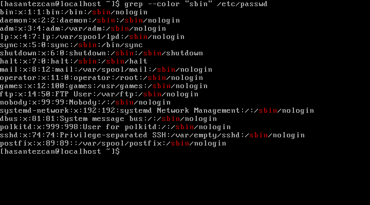
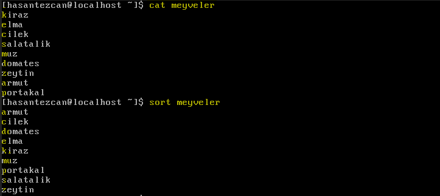

### ÖYYK 2018 - GNU/Linux Sistem Yönetimi 1.Düzey - (GÜN 3)
---

- ***whoami*** - Sizin sistemde hangi kullanıcı ile oturum açtuğınızı gösterir.
```
$ whoami
hasantezcan
```
- ***who*** - O anda sistemde hangi kullanıcıların kabuk oturumu açtığını gösterir.

Terminal öğretisi
-----------------
***>Terminal Nedir?***  
  - Sistemde makineyle iletişim kurmak için kabuk üzerinde çalışan arayüzdür. GUI'li sistemlerde masaüstü de bir terminaldir. Terminal kabuk üzerinde çalışır. Her terminalde ayrı bir shell çalışıyor.

  Rctrl + f2 >> Yeni bir terminal açar.

  Rctrl + f1,f2,f3,f4,f5 >> Terminal arasında geçiş yapar.

  7 tane terminal açabiliriz (acaba bunu artırabilir miyiz?)
  1 tane de masaüstü ortamı ?? debianda 7 tane var ama ubuntuda 11 tane var

---
### Temel Metin Görüntü İşleyiciler

- ***more*** - Bir dökümanı parça parça gösterir
```
$ more /etc/passwd
```

- **less** - Vim'e benzer bir yapısı vardır. less ile dosyalar içerisinde gezebilirsiniz. Vim de kullanılan çoğu komut lessde de çalışır. Metin içi arama yapabilirsiniz. Less'i vimden ayıran fark less'in sadece dosya görüntüleyicisi olmasıdır. Herhangi bir dosya düzenleme işlemi yapamaz.
```
$ less /etc/passwd
```

- ***head*** -  Dosyanın başından 10 satırı bize gösteriri. Ayrıca baştan göstereceği satır sayısını da ayarlamamız için bir parametresi bulunmaktadır.
  ```
  $ head /etc/passwd
  ```

  ```
  $ head -n2 /etc/passwd
  ```
> Dosyanın başından ilk 2 satırı gösterir.

- ***tail*** - Dosyanın sonundan 10 satırı gösterir. -n parametresi ile bu sayıyı değilştirme imkanımız da vardır.
  ```
  $ tail /etc/passwd
  ```

  ```
  $ tail -n2 /etc/passwd
  ```
> Dosyanın başından ilk 2 satırı gösterir.

- ***tac*** - cat'in tam tersidir. Yani dosyayı tersden yazar. Son satırı ilk satır ilk satırı son satır olcak şekilde metni tepe taslak eder.
  Biraz şakalı bir çalıştırabilirdir.
  ```
  $ tac  /etc/passwd
  ```

- ***grep*** - Dosya içerisinde **aratmak** istediğimiz stringin bulunduğu satırı bize gösterir.
  ```
  $ grep "hasantezan" /etc/passwd
  ```
  >Bazı grep prametreleri..  
  **--color** >> aramayı renklendirir aradığınız kelimeyi renkli yazar  
  **-i** >> tüm cevapları getirir  
  **-r** >> recursive (alt dosyaların içinde de arar)  
  **-i** >>  Case sensitive'i kaldır.  
  **-n** >> stringin bulduğu satırın sayısını söyler.  
  **-v** >> aratılan kelime hariç her şeyi gösterir.
  ```
  $ grep -v "hasan" grepTestDoc
  ahmed
  mehmed
  kemal
  ```
  <p align="center">
    
  </p>

 Birden fazla döküman içinde arama yapmak için:
  ```
  $	grep -in "iğne" samanlık0 samanlık1
  ```
  Aramayı tüm dizinlerde (Heryerde) yapmak için..
  ```
  # grep --color -rn "hasantezcan" /*
  ```
>> "grep" çok daha detaylı bir araçtır dahası için..
[gnu.org/software/grep/manual](https://www.gnu.org/software/grep/manual/grep.html)


---
### Regular Expression - REGEX

***^...*** - Şapka işaretinden sonra gelen string ile başlayan kayıtları, getirir.
<p align="center">
  
</p>

***...$*** - Dolar işaretinden önce yazılanlar ile biten satırları yazdırır.
<p align="center">
  
</p>

> "regular expression"lar çok detaylı bir konudur.. bunun için hazılanmış çok detaylı bir anlaatım zaten mevcut [using-grep-regular-expressions](https://www.digitalocean.com/community/tutorials/using-grep-regular-expressions-to-search-for-text-patterns-in-linux)

- ***cut*** - belirlediğimiz şarta göre dikey böler.
```
cut -d ":" -f 3 /etc/passwd
````
> ***-d*** - delimineter(ayırıcı) kendinden sonraki işareti ayırıcı olrak kullanır.
***-f sayı*** - fields - ayrılan bölmelerin arasında verilen numaraya uygun olan sütünü getirir. sayılar 7,5 denerek de iki tane girilebilir.

<p align="center">
  
</p>


\*  - Herhangi bir karakterin yerine geçer. Ve adet sınırı yok

***?*** - Her karakterin yerine geçebilir ama sadece bir tanesi(adet) için.

- **tr** herhangi bir karakteri herhangi bir karakter ile değiştir.

- **uniq** - Tekrarlanan stringleri *tek defa* yazar (Tekrar eden satırları gizler..)
> ***-D*** - sadece tekrar edenler yazılır....

<p align="center">
  
</p>

- **sort** - Dosya içindeki satırları sıralamak için vardır..
<p align="center">
  
</p>

  >***uniq*** komutu birbirinden ayrı satırlarda çalışmaz. Bu yüzden öncelikle **sort** ile listeleriz sonrasında **uniq** ile tekilleştiririz.
  ```BASH
  cat a.txt | sort | uniq
  ```

- **wc** - Sayı sayacı...
```
$ wc meyveler
9 9 61 meyveler
-------------
9 satır sayısı
9 toplam kelime sayısı
61 toplam harf sayısı
```

## Standart Girdi Çıktı
<p align="center">
  
</p>

- Linux sistemlerde başarılı şekilde çalıştırılan komut sonrası ekrana yazılan değer ***standart çıktı(stdout)*** dır. Hatalı çalıştırılan komut sonrası terminal üzerinde gördüğümüz mesaj ise ***standart hata(stderr)*** yı oluşturmaktadır.

- ***Bir bilgisayara nasıl veri gireriz?***, **Girdi Yöntemleri**
  - ***Klavye*** : En fazla kulandığımız yöntemdir.
  - ***Fare*** : Obje seçimleri de bir girdidir.
  - ***Tarayıcı(Scanner)*** :
  - ***Kameralar*** :

- Olayı anlamak için biraz örnek yapalım...

Öncelikle pwd diyerek hangi dizinde bulunduğumuzu görelim..

```
$ pwd
/home/hasantezan
```
Klavyeden girdiğim **"pwd"** komutu bir **standart girdi** olup komutun çalıştırılması sonucu yukarıda dönen değer ise **standart çıktı** yı oluşturmaktadır.

Peki yanlış bir komut çalıştırmaya çalışsaydım **ne olacaktı?**
```
$ pwwwd
-bash: pwwd: command not found

$ mkdir -q hasantezcan
mkdir: invalid option -- 'q'
Try 'mkdir --help' for more information.
```
Yukarıda gördüğünüz gibi komut ismini yanlış yazdığımda veya olmayan bir parametre vermek istediğimde hata mesajı ile karşılaşıyorum. Bu mesaj da bizim standart hata(stderr)mızıoluşturmaktadır.

**Standart girdi, çıktı ve hatayı nasıl yönlendirme:**

Standart bir çıktıyı ekranda görmek istemiyorumda bir dosyaya yönlendirmek istiyorum;

```
$echo "testYazisi" > yönleniyor.txt
```
Yukarıdaki komut ile **"yönleniyor.txt"** adında bir dosya açılır ve içine **"testYazisi"** yazılır. Eğer daha önceden **"yönleniyor.txt"** isimli bir dosya varsada bu dosyanın direk olarak üstüne yazılır.(içindekiler de silinmiş olur)

Mesajınızı dosyadaki verilerin **üzerine yazmak** değilde önceki verilerin ***altına eklemek*** isterseniz(yani dosyanın içindekiler silinmesin isterseniz) kullanacağınız komut;
```
$echo "testYazisi" >> yönleniyor.txt
```

>Özetle;   
tek ok işareti "override" **">"** dosya üzerine yazıyor   
çift ok işareti "pend" **">>"** dosyaya ekleme yapıyor.(altına yazar.)

**Kanal Yönetimi:**
Şimdi de dönen hata mesajını dosyaya nasıl yönlendiririz onu inceleyelim;
```
$ lss -la 2>deneme.txt
```
yukarıdaki komut ile dönen hata mesajını deneme.txt isimli dosyamıza yönlendirmiş olduk.   

Burda kullanmış olduğumuz **"2"** ***stderr***'u temsil eder yani aslında bash'e diyoruz ki **"lss -la"** komutunu çalıştır. Sonra bu komudun **stderr** çıktısını al, ve **"deneme.txt"** içine ***yaz.***

Ama siz o **"2"** yerine **"1"** yazsaydınız şuan elde ettiğimiz sonuçu elde edemezdiniz. Çünkü bu sefer bash'e:  git **"lss -la"** komutunun **"stdout"** çıktısını ***"deneme.txt"*** ye bas demiş olurdunuz. Fakat öyle bir çıktı olmadığından **bash** dosyaya herhangi bir şey basamazdı ve ***boş*** bir dosya oluşturmuş olurdunuz.

**Bir komutun tüm çıktılarını bir dosyaya yazmak:**
```
head /etc/passwdd &>> p.txt

grep -R --color hasantezcan /home &>> nerdeyimBen.txt
```
Bu komut sayesinde bir komutdan gelebilecek tüm çıktıları bir dosya içine yazmış oluyoruz..

**Yönlendirme Olayı Nerelerde Kullanılabilir?**  
Mesela bir serverda çokca hata vermesi muhtemel bir komut çalıştıracağız ama bu hataları şimdi değilde sonra okumak istiyoruz bu gibi bir durumda yönlendirmeler kullanılabilir.

 > Bu konu ile ilgili detaylı başka bir yazıda burada mevcut. [linux-redirecting-piping-nedir](https://siberoloji.github.io/linux-redirecting-piping-nedir/)

**>Komplike bir yönlendirme örneği..(Yanlış Olabilir..)**
```
head /etc/passwd | tail -n3 | tail -n20 /etc/passwd | head -n5 | sort >> son.text
```

---
**> Kaynakça**

- ***Özgür Yazılım Yaz Kampı eğitmeni - [Dora Uzunsoy](https://twitter.com/dorauzunsoy)***

- ***Standart Girdi Çıktı ve Hata - [yasingokhantaskin.net](http://yasingokhantaskin.net/index.php/2017/01/22/standart-girdi-cikti-ve-hata/)***
